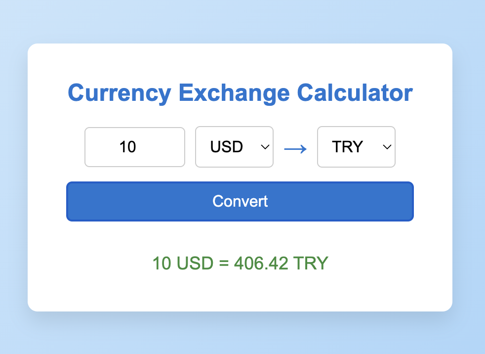

# 💱 Currency Exchange Calculator

A simple currency converter app built with React using the [Frankfurter API](https://www.frankfurter.app/). Convert between currencies in real-time with live exchange rates.

## 🚀 Features

- Convert any amount between major currencies
- Fetches real-time exchange rates from [Frankfurter API](https://www.frankfurter.app/)
- Clean and intuitive UI
- Handles loading and error states

## 🖥️ Preview



## ⚙️ How It Works

The app fetches available currencies on load and allows users to:
- Input an amount
- Choose source and target currencies
- Convert to see the current exchange rate result

## 📦 Installation

```bash
git clone https://github.com/yourusername/currency-converter.git
cd currency-converter
npm install
npm start
```

## 🔧 Tech Stack

- React (with Hooks)
- Fetch API
- CSS (basic styling)
- [Frankfurter Exchange Rates API](https://www.frankfurter.app/)

## 📂 Project Structure

```
public/
  └── result.png           # Screenshot of the working app
src/
  └── App.js               # Main application component
  └── index.js             # React entry point
```

## 🌍 API Reference

**GET** `https://api.frankfurter.app/latest?amount=AMOUNT&from=FROM_CURRENCY&to=TO_CURRENCY`

Returns:
```json
{
  "amount": 1,
  "base": "USD",
  "date": "2025-08-07",
  "rates": {
    "EUR": 0.92
  }
}
```

## ⚠️ Error Handling

- Displays an error if the amount is invalid or zero
- Handles fetch failures gracefully

